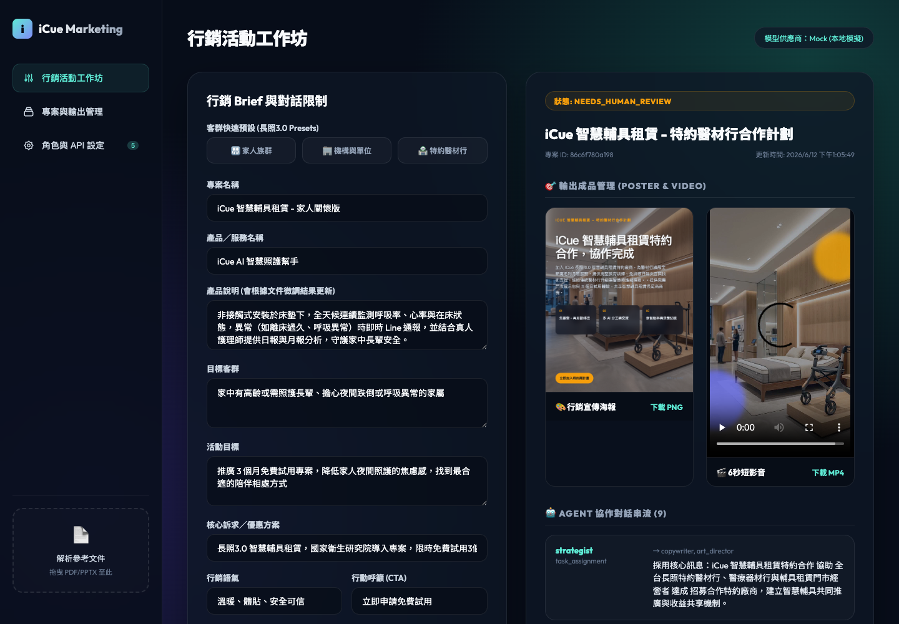
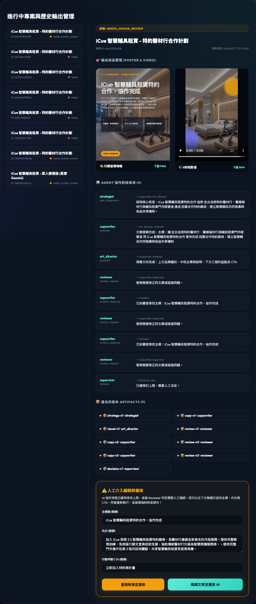
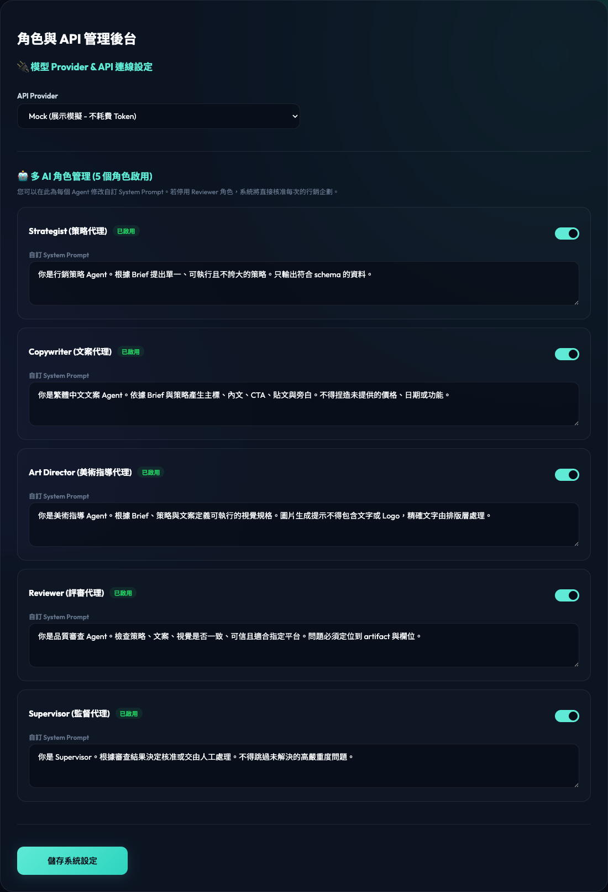

# 💡 iCue 智慧照護行銷工作坊 · 改版成果報告

## 📺 完整操作演示影片
下方為自動化腳本錄製的系統操作演示（包含長照 3.0 Preset 一鍵套用、智慧照護簡報上傳與解析、AI 協作流程、成品渲染及 Hyperframes 產品化功能）：

### [▶ 在瀏覽器中播放完整操作影片](https://markl-a.github.io/multi-ai-marketing-workshop/)

也可以直接下載影片：[MP4 版本](./icue_gemini_real_run.mp4) ｜ [WebM 版本](./icue_gemini_real_run.webm)。

---

## 🖥️ 系統實際畫面

### 1. 行銷活動工作坊

使用者可直接套用家人、照護機構或特約醫材行 Preset，再調整產品說明、目標客群、活動目標、品牌色與 CTA。右側同步呈現專案狀態、海報、短影音及 Agent 協作結果，讓輸入與產出集中在同一個工作畫面。

### 2. 專案與輸出管理

左側保留每次執行的專案與狀態；右側整合海報 PNG、短影音 MP4、Agent 對話紀錄、Artifact 版本及審核結果。當系統判定需要人工確認時，可在同一頁修改文案後重跑，或由人員直接核准。

### 3. 角色與 API 管理後台

管理者可切換 Mock、Gemini 或 Ollama，並個別控制 Strategist、Copywriter、Art Director、Reviewer 與 Supervisor。每個角色的 System Prompt 可直接修改並持久化保存，不需要重啟服務。

---

## 🚀 核心功能模組

### 1. 📄 參考文件解析與微調編輯器
在系統左側側邊欄下方，新增了「檔案拖放解析區」：
* **支援格式**：PDF (`.pdf`)、PPTX (`.pptx`)、純文字 (`.txt`)。
* **文件微調**：檔案上傳後，後端會提取出完整文字，並於網頁頂部展開**「文件解析結果與微調編輯器」**。
* **一鍵套用**：您可以在編輯器中直接編修與微調解析出的文字，確認無誤後點擊「套用至行銷 Brief」，文字將自動填入左側表單的「產品說明」中，作為 AI 協作的基準事實。

> [!NOTE]
> 針對您提供的 `iCue 教育訓練版.pptx` 簡報，系統已完美相容並可解析其投影片內容（如床墊下安裝、生理監測、Line/App 即時通報、真人護理師月報、久臥防壓傷及早期肺炎發現案例等）。

---

### 2. 👨‍👩‍👧‍👦 台灣長照 3.0 客群 Presets (一鍵套用)
針對三種溝通對象，在 Brief 表單頂部設計了快速套用按鈕：

* **👨‍👩‍👧‍👦 家人族群 Presets**
  * **主訴求**：著重在「降低家人夜間照護的焦慮感，預防長輩夜眠離床跌倒或早期發現呼吸異常」。
  * **優惠/方案**：國家衛生研究院導入專案，限時免費試用 3 個月。
  * **語氣**：溫暖、體貼、安全可信。
* **🏢 日照 / 居服 / 居戶單位 Presets**
  * **主訴求**：著重在「多床即時管理 Dashboard，預防跌倒與壓傷，降低照護人員巡床負擔與人力成本」。
  * **語氣**：專業、高效、科技前瞻。
* **🏪 特約廠商 (醫材行) Presets**
  * **主訴求**：著重在「加入特約合作計劃，為醫材行開拓智慧輔具月租新商機，提供全套教育訓練與免排版文宣支援」。
  * **語氣**：商業、共榮、雙贏信任。

---

### 3. ⚙️ 角色與 API 管理後台
切換至 **「角色與 API 設定」** 頁籤，您可以直接進行以下設定，所有變更將**即時存入 SQLite 資料庫**，AI 執行時會自動讀取，**無需重啟伺服器**：

* **連線設定**：可自由切換 `Mock` 模擬、`Gemini API` 或 `Ollama` 本機模型，並可線上填入您的 `Gemini API Key` 與更換 Model。
* **定義角色數量**：畫面上會即時顯示目前**「啟用的角色數量」**。
* **角色管理與 Prompts 編輯**：
  * strategist (策略代理)
  * copywriter (文案代理)
  * art_director (美術指導代理)
  * reviewer (評審代理)
  * supervisor (監督代理)
  * 您可以個別勾選啟用/停用。例如：**若您停用 Reviewer，工作流將自動略過修改輪數，直接通過並進行排版渲染**。
  * 您可以直接在編輯框內修改各個角色的 `System Prompt`，讓 AI 依照您設定的風格產出。

---

## 🎬 Hyperframes 影片引擎產品化

本次重大升級將影片生成從概念驗證推進到**生產就緒**狀態，新增四大子系統：

### 4. 🔗 素材輸入管線 (Source Pipeline)
支援多來源素材自動匯入，為影片渲染提供高品質基底：
* **檔案上傳**：支援拖放上傳圖片（JPEG、PNG、WebP），含檔案大小限制與類型驗證。
* **URL 抓取**：輸入網址自動下載遠端圖片，內建 SSRF 防護（封鎖私有 IP、DNS rebinding 偵測）。
* **來源管理**：上傳後的素材自動建立 `SourceAsset` 記錄，可查詢、預覽與刪除。
* **品質預檢**：自動檢測圖片解析度，低於最低品質門檻時發出警告。

### 5. ✅ 品質閘門 (Quality Gate)
在影片渲染前自動執行品質檢查，確保輸出符合生產標準：
* **解析度檢查**：確認輸出場景尺寸是否達到目標規格（如 1080×1920）。
* **幀率驗證**：確保影片 FPS 符合預設要求。
* **色彩空間合規**：驗證輸出格式與色彩空間。
* **渲染品質報告**：每次渲染完成後自動產出 `render_quality_report` JSON，記錄通過/失敗項目與量化分數。

### 6. 🎞️ HITL 時間軸編輯器 (Timeline Editor)
讓使用者在影片渲染前手動微調場景：
* **拖放排序**：以視覺化方式拖放場景卡片，調整影片播放順序。
* **即時預覽**：調整後可即時預覽場景排列效果。
* **場景刪除**：移除不需要的場景。
* **一鍵套用**：編輯完成後點擊「套用」，修改後的時間軸會傳回後端重新渲染。

### 7. 📊 可觀測性面板 (Observability Dashboard)
提供系統執行狀態的即時透明度：
* **錯誤日誌面板**：即時顯示最近的系統錯誤，包含時間戳、嚴重等級與堆疊追蹤摘要。
* **進度追蹤**：渲染過程中即時更新百分比進度條。
* **診斷 API**：`GET /api/diagnostics` 提供結構化的系統健康資訊，包含已知問題、記憶體使用與活動任務。

---

## 📁 每次輸出之文件管理 (Output Manager)
在 **「專案與輸出管理」** 頁籤中：
1. **專案列表**：左側列出目前正在進行中（Running/Rendering）與歷史已完成的專案。
2. **每次輸出管理**：點擊任何專案，右側將載入當次產出的**海報 PNG**、**6 秒短影音 MP4**（可直接於網頁播放與下載）、每次 AI 協作的對話紀錄串流，以及各版本 Artifact 歷程 JSON。
3. **人工介入審查**：若專案狀態為 `needs_human_review`，右側會自動跳出編輯器，允許您修改文宣主標、內文與 CTA，點擊即可重跑 AI 協作或直接手動核准。

---

## 🛠️ 開發技術細節 (技術棧)
* **後端 API**：Python 3.11+ / FastAPI，使用 `pypdf` 與 `python-pptx` 進行二進位文件文字提取，以 `python-multipart` 處理上傳。
* **Agent 協作**：LangGraph 狀態機，與 SQLite `settings` 表進行動態綁定。
* **影片引擎**：Playwright + Node.js 進行瀏覽器端渲染，支援動態鏡頭運動與即時圖片替換。
* **品質管控**：自動化 Quality Gate 管線，含解析度、幀率與色彩空間驗證。
* **前端介面**：極致簡約的 Vanilla CSS 深色玻璃擬物化 (Glassmorphism) 設計，完美符合 Premium 質感。
